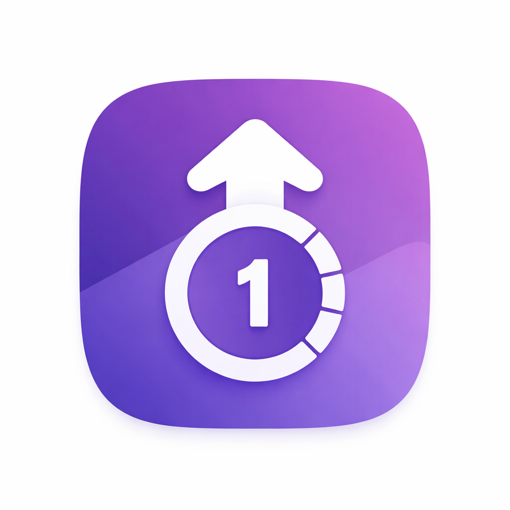

<p align="center">
  
</p>

<h1 align="center">CounterApp</h1>

<p align="center">
  A minimal Android app for organizing and tracking counts across categories with automatic time tracking.
</p>

---

## Features

- **Categories** — Organize counters into named categories with summary stats
- **Counters** — Track tallies with +1, +5, +10 increment buttons
- **Automatic Time Tracking** — Timer starts when you open a counter, pauses when you leave
- **Category Analytics** — Total count, total time, average count, and most active counter
- **Edit Dialog** — Manually override count and time values
- **Offline & Private** — All data stored locally with Room, zero permissions required
- **Material You** — Dynamic color theming on Android 12+

## Screens

| Home | Category Detail | Counter Detail |
|------|----------------|----------------|
| Category list with stats | Counters + analytics banner | Large count, live timer, increment buttons |

## Tech Stack

| Component | Technology |
|-----------|------------|
| Language | Kotlin |
| UI | Jetpack Compose (Material 3) |
| Architecture | MVVM + ViewModels + StateFlow |
| Database | Room (SQLite) |
| DI | Hilt |
| Navigation | Jetpack Navigation Compose |
| Async | Kotlin Coroutines + Flow |
| Min SDK | 28 (Android 9) |
| Target SDK | 35 |

## Getting Started

1. Clone the repository
   ```bash
   git clone git@github.com:pinnaclecode-solutions/CounterApp.git
   ```
2. Open in Android Studio (Meerkat or later recommended)
3. Sync Gradle and run on a device or emulator

## Project Structure

```
com.example.counterapp/
├── data/
│   ├── local/          — Room entities, DAOs, database
│   └── repository/     — CounterAppRepository
├── di/                 — Hilt modules
├── ui/
│   ├── home/           — Home screen (category list)
│   ├── category/       — Category detail screen
│   ├── counter/        — Counter detail + edit dialog
│   ├── components/     — Shared composables
│   └── theme/          — Material 3 theme
├── navigation/         — Nav graph and route definitions
├── util/               — TimeFormatter
├── CounterApp.kt       — Application class
└── MainActivity.kt     — Single activity entry point
```

## License

This project is proprietary. All rights reserved.
